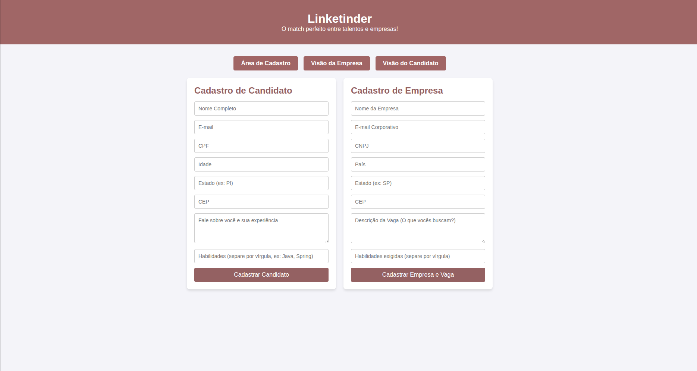

# LinkeTinder TypeScript


-6B7280)

MVP do LinkeTinder para conectar talentos e empresas, com foco em fundamentos de TypeScript, arquitetura em camadas e evolução futura para backend real.

## 🎬 Demonstração

- Tela de cadastro
  
- Visão da empresa com gráfico de competências (Chart.js)
  
- Tooltip flutuante com anonimato dos dados sensíveis
  

## 🧠 Contexto do Projeto

O objetivo deste MVP é simular uma plataforma de match entre candidatos e empresas:

- Candidato e empresa se cadastram com dados e habilidades
- Vagas são publicadas pela empresa e listadas para os candidatos com dados sensíveis anonimizados
- Competências dos candidatos são apresentadas em gráfico para tomada de decisão rápida

## 💻 Tecnologias

### Frontend

- TypeScript + HTML + CSS em abordagem Vanilla (sem frameworks)
  - Escolha intencional para consolidar fundamentos de linguagem, tipagem, manipulação de DOM e organização por módulos ES6
- Chart.js integrado via CDN
  - Utilizado para plotagem do gráfico de competências dos candidatos na visão da empresa
- Módulos ES6 (`import`/`export`)
  - Código separado por responsabilidades, com build para `dist/` via TypeScript

### Backend (MVP atual)

- Backend simulado (mockado) usando LocalStorage do navegador
  - Operações de Create e Delete persistem dados localmente no browser
- Arquitetura em camadas: models, repositories, services e validators
  - Cada camada tem responsabilidade única e bem definida
  - Facilita migração futura para API REST + banco de dados real sem reescrever a camada de telas

## 🧩 Design Patterns Aplicados

### 1. Singleton — Repositories

**Onde:** `CandidatoRepository`, `EmpresaRepository`, `VagaRepository`

Cada repository expõe um construtor `private` e um método estático `getInstance()`. A primeira chamada cria a instância; as seguintes retornam sempre a mesma.

```ts
// CandidatoRepository.ts
private static instance: CandidatoRepository

private constructor() {}

static getInstance(): CandidatoRepository {
    if (!CandidatoRepository.instance) {
        CandidatoRepository.instance = new CandidatoRepository()
    }
    return CandidatoRepository.instance
}
```

**Por quê melhora o código:**
Os repositories são a ponte direta com o `localStorage`. Ter múltiplas instâncias não quebra nada, mas cria objetos desnecessários e abre margem para estados divergentes se a camada de persistência evoluir. Com Singleton, há uma única fonte de verdade por entidade, e qualquer código que acesse o repository — seja o service, seja a tela de perfil — opera sobre o mesmo objeto.

---

### 2. Factory — Criação de objetos de domínio

**Onde:** `src/factories/CandidatoFactory.ts`, `EmpresaFactory.ts`, `VagaFactory.ts`

Cada factory expõe um método estático `criar()` que recebe os dados sem `id` (`Omit<T, 'id'>`) e entrega o objeto completo com o identificador gerado internamente.

```ts
// CandidatoFactory.ts
static criar(dados: Omit<Candidato, 'id'>): Candidato {
    return {
        id: Math.random().toString(36).substring(2, 9),
        ...dados
    }
}
```

**Por quê melhora o código:**
Antes, a geração do `id` e a montagem do objeto estavam espalhadas diretamente nas funções do formulário. Com as factories, essa responsabilidade fica centralizada: se a estratégia de geração de ID mudar (ex.: UUID, sequencial, vindo do backend), altera-se apenas a factory, sem tocar nas telas.

---

### 3. Factory — Criação e composição dos Services (ServiceFactory)

**Onde:** `src/factories/ServiceFactory.ts`

A `ServiceFactory` é responsável por montar cada service com suas dependências (repository + validator) e manter uma única instância de cada um — combinando Factory com comportamento de Singleton para a camada de serviços.

```ts
// ServiceFactory.ts
static criarCandidatoService(): CandidatoService {
    if (!ServiceFactory.candidatoService) {
        ServiceFactory.candidatoService = new CandidatoService(
            CandidatoRepository.getInstance(),
            new CandidatoValidator()
        )
    }
    return ServiceFactory.candidatoService
}
```

**Por quê melhora o código:**
Antes, `formularioCadastro.ts` instanciava manualmente cada service com seus `new Repository()` e `new Validator()`. Isso acoplava a tela ao detalhe de construção de cada dependência. A `ServiceFactory` isola essa lógica de composição em um único lugar: trocar uma implementação de repository (ex.: de `localStorage` para API REST) requer mudança apenas na factory, não nas telas.

---

### 4. Dependency Injection — Injeção via construtor nos Services

**Onde:** `CandidatoService`, `EmpresaService`, `VagaService`

Cada service declara suas dependências no construtor e trabalha contra interfaces (`ICandidatoRepository`, `IEmpresaRepository`, `IVagaRepository`), não contra implementações concretas.

```ts
// CandidatoService.ts
constructor(
    private repository: ICandidatoRepository,
    private validator:  CandidatoValidator
) {}
```

**Por quê melhora o código:**
O service não sabe — nem precisa saber — se os dados vêm do `localStorage`, de uma API ou de um mock de testes. Qualquer classe que implemente `ICandidatoRepository` pode ser injetada. Isso permite trocar a camada de dados sem modificar a lógica de negócio e facilita a escrita de testes unitários com implementações alternativas (fakes/mocks).

---

### 5. Repository Pattern — Abstração da camada de dados

**Onde:** interfaces `ICandidatoRepository`, `IEmpresaRepository`, `IVagaRepository` + suas implementações

Cada repository encapsula toda operação sobre uma entidade específica (`listar`, `salvar`, `deletar`). Os services consomem apenas a interface, nunca o `localStorage` diretamente.

**Por quê melhora o código:**
Separa o "o quê" (regra de negócio no service) do "como" (persistência no repository). Quando o projeto evoluir para uma API REST, bastará criar uma nova implementação das interfaces — toda a camada de serviços permanece intacta.

---

## 🏗️ Refatoração para MVC Completo

### O problema antes da refatoração

Os arquivos de tela (`formularioCadastro.ts`, `perfil-candidato.ts`, `perfil-empresa.ts`) acumulavam duas responsabilidades distintas no mesmo lugar:

- **Lógica de controle**: capturar eventos de formulário, chamar services, tomar decisões
- **Lógica de renderização**: construir `<tr>`, `<li>`, manipular `innerHTML`, posicionar tooltips

Isso violava o princípio MVC porque não havia separação entre quem decide (Controller) e quem exibe (View). Qualquer mudança visual exigia mexer no mesmo arquivo que continha regras de fluxo, e vice-versa.

---

### O que foi corrigido

#### 1. Extração das Views

Criada a camada `src/views/` com três classes, cada uma responsável exclusivamente por manipular o DOM de uma tela:

| Arquivo | Responsabilidade |
|---|---|
| `FormularioCadastroView.ts` | Lê valores dos inputs, renderiza lista de sugestões de empresa, expõe métodos de seleção e limpeza |
| `VagaListView.ts` | Monta as linhas da tabela de vagas e configura os tooltips flutuantes |
| `CandidatoListView.ts` | Monta a tabela de candidatos, configura tooltips e renderiza o gráfico Chart.js |

As Views não chamam nenhum service e não criam objetos de domínio. Recebem dados prontos e apenas exibem.

#### 2. Extração dos Controllers

Criada a camada `src/controllers/` com três classes, cada uma responsável por orquestrar o fluxo de uma tela:

| Arquivo | Responsabilidade |
|---|---|
| `CadastroController.ts` | Registra os listeners dos formulários de candidato, empresa e vaga; usa factories para criar os objetos e chama os services |
| `PerfilCandidatoController.ts` | Busca vagas e empresas nos services e entrega os dados à `VagaListView` para renderização |
| `PerfilEmpresaController.ts` | Busca candidatos no service e entrega à `CandidatoListView` para renderização e geração do gráfico |

Os Controllers não tocam diretamente no DOM — toda manipulação visual é delegada à View.

#### 3. Entry points reduzidos a composição pura

Os arquivos de entrada (`formularioCadastro.ts`, `perfil-candidato.ts`, `perfil-empresa.ts`) passaram de ~180 linhas de lógica mista para 9 linhas cada: instanciam controller com suas dependências via `ServiceFactory` e chamam `init()`.

```ts
// formularioCadastro.ts — antes: ~180 linhas com lógica, DOM e criação de objetos
// formularioCadastro.ts — depois:
const controller = new CadastroController(
    ServiceFactory.criarCandidatoService(),
    ServiceFactory.criarEmpresaService(),
    ServiceFactory.criarVagaService(),
    new FormularioCadastroView()
)
controller.init()
```

---

### Como a refatoração tornou o código melhor

**Responsabilidade única por arquivo**: cada classe tem uma razão para mudar. Alterar o visual de um tooltip → mexe só na View. Alterar a regra de qual empresa mostrar no autocomplete → mexe só no Controller.

**Testabilidade**: é possível testar o Controller injetando uma View falsa (mock) sem abrir nenhum navegador. Antes, testar o fluxo de cadastro exigia simular toda a estrutura do DOM junto.

**Legibilidade**: um desenvolvedor lendo `CadastroController` entende o fluxo completo da tela sem precisar rastrear código de DOM misturado. Um desenvolvedor lendo `FormularioCadastroView` entende exatamente quais elementos de tela existem, sem ver lógica de negócio.

**Evolução independente**: se o design mudar completamente (ex.: substituir a tabela por cards), apenas a View é reescrita. O Controller e os services continuam intactos.

---

## 🧱 Estrutura do Projeto

```text
.
├── cadastro.html
├── perfil-candidato.html
├── perfil-empresa.html
├── tsconfig.json
├── css/
│   └── style.css
├── src/
│   ├── formularioCadastro.ts   ← entry point (composição + init)
│   ├── perfil-candidato.ts     ← entry point (composição + init)
│   ├── perfil-empresa.ts       ← entry point (composição + init)
│   ├── controllers/            ← C: orquestra eventos → service → view
│   │   ├── CadastroController.ts
│   │   ├── PerfilCandidatoController.ts
│   │   └── PerfilEmpresaController.ts
│   ├── views/                  ← V: manipula DOM, nunca chama service
│   │   ├── FormularioCadastroView.ts
│   │   ├── VagaListView.ts
│   │   └── CandidatoListView.ts
│   ├── factories/              ← criação de objetos e composição de dependências
│   │   ├── CandidatoFactory.ts
│   │   ├── EmpresaFactory.ts
│   │   ├── VagaFactory.ts
│   │   └── ServiceFactory.ts
│   ├── models/                 ← M: interfaces de domínio
│   │   ├── Candidato.ts
│   │   ├── Empresa.ts
│   │   └── Vaga.ts
│   ├── repositories/           ← M: acesso a dados (Singleton + interfaces)
│   │   ├── CandidatoRepository.ts
│   │   ├── EmpresaRepository.ts
│   │   ├── VagaRepository.ts
│   │   ├── ICandidatoRepository.ts
│   │   ├── IEmpresaRepository.ts
│   │   └── IVagaRepository.ts
│   ├── services/               ← M: regras de negócio (DI via construtor)
│   │   ├── CandidatoService.ts
│   │   ├── EmpresaService.ts
│   │   └── VagaService.ts
│   └── validators/             ← M: validações e máscaras
│       ├── CandidatoValidator.ts
│       ├── EmpresaValidators.ts
│       ├── VagaValidator.ts
│       └── mascaras.ts
└── dist/
```

## 🚀 Como Executar

### Pré-requisitos

- Node.js instalado
- TypeScript instalado globalmente
- Extensão Live Server no VS Code (ou outro servidor local HTTP)

Instalação global do TypeScript (se necessário):

```bash
npm install -g typescript
```

### Passo a passo

1. Clone o repositório:

```bash
git clone https://github.com/fernandosantos01/ZG-Hero-Project-K1-T7-Typescript-Linketinder.git
```

2. Acesse a pasta do projeto:

```bash
cd LinkeTinderTypeScript
```

3. Compile os arquivos TypeScript para JavaScript:

```bash
tsc -w
```

4. Inicie um servidor local na raiz do projeto:

```bash
# opção recomendada no VS Code
# clique com botão direito em cadastro.html e use "Open with Live Server"
```

5. Acesse no navegador (pela URL do servidor local):

- `cadastro.html`
- `perfil-empresa.html`
- `perfil-candidato.html`

### ⚠️ Importante: "Pulo do CORS"

Este projeto usa módulos ES6 (`type="module"`, `import` e `export`).

Por isso, os arquivos HTML **não devem** ser abertos com duplo clique (`file://...`), pois o navegador bloqueará carregamento de módulos por política de segurança (CORS).

Use sempre um servidor local HTTP (ex.: Live Server).

## ✅ Funcionalidades MVP

- Cadastro de candidatos com validação e máscaras automáticas (CPF, CNPJ, telefone, CEP)
- Cadastro de empresas
- Publicação de vagas com **busca de empresa por nome** (autocomplete)
- Listagem de vagas para candidatos com título, competências e localização
- Tooltip com anonimização de dados sensíveis (nome e CPF ocultos)
- Gráfico de competências dos candidatos com Chart.js
- Persistência local via LocalStorage
- Arquitetura em camadas (models / repositories / services / validators)

## 🔍 Autocomplete de Empresa na Publicação de Vaga

Ao publicar uma vaga, o usuário digita o nome da empresa no campo de busca. O sistema filtra em tempo real as empresas cadastradas e exibe uma lista de sugestões. Ao selecionar uma empresa, o ID é preenchido automaticamente em um campo oculto — sem necessidade de copiar ou informar IDs manualmente.

## 🔒 Regras de validação e formatação

O fluxo de cadastro aplica validações antes de persistir os dados:

- Nome com tamanho mínimo e caracteres válidos
- E-mail em formato válido
- CPF e CNPJ em formato mascarado
- Telefone em padrão nacional
- CEP no formato 00000-000
- LinkedIn com URL válida de perfil
- Habilidades e competências separadas por vírgula

As máscaras são aplicadas em tempo real nos inputs para melhorar a experiência de preenchimento.

## 🛣️ Próximos Passos

- Substituir camada mockada por API real
- Adicionar banco de dados relacional ou NoSQL
- Criar autenticação/autorização
- Implementar testes automatizados (unitários e integração)
- Evoluir UX com feedback visual de sucesso/erro

## 👨‍💻 Autor

José Fernando.
